# 'dex 98

Recreation of assets from the Tiger 1998 Pokedex (Generation 1).

---
 

## Introduction

*Work in progress*

I welcome feedback and suggestions, to continue improving the project for everyone. It really motivates me that people enjoy my work. Please keep the data gnomes fed with a [star](https://github.com/ace-dent/dex-1998/stargazers)! ⭐️

## Gallery

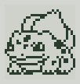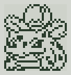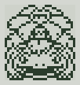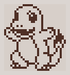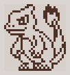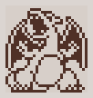  
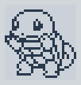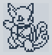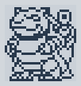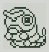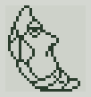  
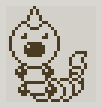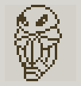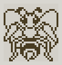

## Methods

## Acknowledgements

Image wrangling with ImageMagick, compressed with Oxipng and metadata added with ExifTool.

Special thanks to @crait for the original [idea](https://community.arduboy.com/t/pokedex-for-arduboy/12469/16) and valuable discussions.  

## Legal

This project is intended to recreate and archive work based on photographs of an original device. Its purpose is strictly for archival preservation and documentation. No original code, assets, or materials have been derived from reverse engineering. It is believed that the work is sufficiently transformative and of artistic merit, such that it does not infringe upon the rights of the original copyright holder(s). No warranty is provided regarding the accuracy, legality, or suitability of this work. This statement does not constitute legal advice.

Produced by Andrew C.E. Dent and dedicated to the Public Domain (CC0 – free to use). Giving attribution is not required but always appreciated! Please read the separate `LICENSE` file.

All trademarks are the property of their respective owners, including:  
&emsp; Tiger Electronics, Ltd.  
&emsp; Hasbro, Inc.  
&emsp; Nintendo Co., Ltd.  
&emsp; Creatures Inc.  
&emsp; GAME FREAK Inc.

